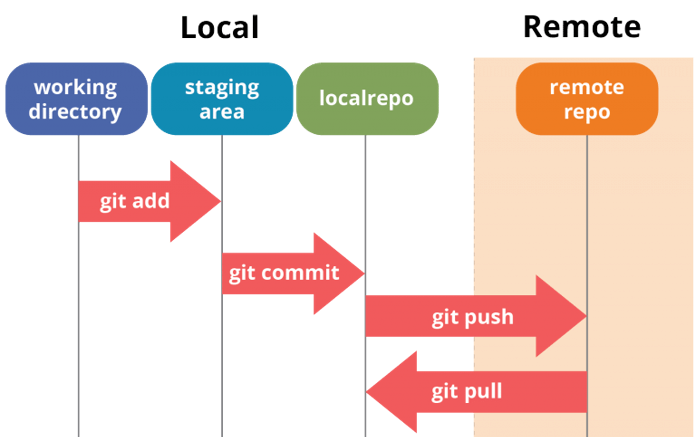

# Git - Fonctionnement et commande de base

---
# Git
Dans le cadre du cours, la majorité des notes de cours et exercices seront déposé sur Github.
Une fois que vous aurez créé votre compte Github, je vous donnerez accès aux dépôts du cours.  Vous pourrez ensuite cloner le dépôts du cours.

---
# Commandes (1/2)
### git clone
`git clone <url>` : Cette commande est utilisée pour cloner (copier) un dépôt à partir d'une URL existante.
### git add
`git add <fichier>` : Cette commande ajoute un fichier à la zone de préparation pour le prochain commit.
### git commit
`git commit -m "<message>"` : Cette commande enregistre vos modifications dans le dépôt local. Le message qui suit `-m` est utilisé pour noter l'intention du commit.

---
# Commandes (2/2)
### git push
`git push` : Cette commande envoie les commits de la branche locale vers le dépôt distant nommé.
### git pull
`git pull` : Cette commande récupère et fusionne les modifications du dépôt distant vers votre branche locale.
### git fetch
`git fetch` : Cette commande récupère toutes les modifications du dépôt distant, mais ne les fusionne pas avec votre branche locale.

---
# Github Desktop
- Notez que si vous utilisez Github Desktop, il y aura des boutons qui exécute les commandes pour vous.
  - Assurez-vous seulement de savoir quelle commande sert à quoi.

---
# .gitignore
- Il est possible d'ajouter un fichier .gitignore à la racine du dépôt Git.
- Ce fichier permet d'indiquer s'il y a des fichiers ou des dossiers que nous ne voulons pas inclure dans le dépôt.
  - Par exemple: Des fichiers de compilation, des logs, etc.
- Lorsque vous créez un nouveau dépôt sur Github, vous avez la possiblité d'ajouter un fichier .gitignore selon un template choisi.

# readme.md
- Il est possible d'ajouter un fichier readme.md à la racine du dépôt Git.
- Ce fichier permet d'écrire en Markdown de l'information sur le dépôt.
  - Par exemple: Auteur, nom du projet, etc.
- Lorsque vous créez un nouveau dépôt sur Github, vous avez la possiblité d'ajouter automatique un fichier readme.md.
  - Prenez l'habitude de le faire et de, au minimum, écrire votre nom et le nom du projet dans celui-ci.

---
# Schémas récapitulatif
